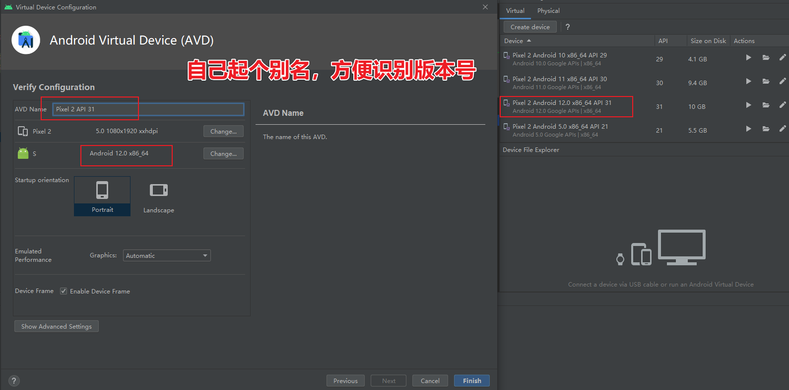

# Android

> [!NOTE]
> 有时候`C/C++程序`需要在Android上面运行，我们需要依赖`Java native`才能进行交叉编译，相当于套了一层壳。

> [!Danger]
> Android Studio可能是Java的限制，直接调试`C/C++程序`很容易出现`断点`死活跳不进去。

## 安装toolbox

[Toolbox官网](https://www.jetbrains.com/zh-cn/toolbox-app)


# 安装Android Studio


# Android Studio使用教程

## 创建C++工程


## 创建虚拟机


## 选择Pixel2


## 选择镜像


## 起个镜像别名



## 启动虚拟机


## 关闭虚拟机


## 安卓路径问题


## 安卓启动入口绑定


## 安卓main函数入口


## 第三方库说明


## 挂代理

建议挂代理，Android Studio访问谷歌更方便


## 查看内存和网络


## 不要点这个清理缓存


## 删除缓存


## 刷新项目文件


## 开始编译


## 安卓打印问题

安卓控制台不支持C/C++打印，需要专属的`__android_log_print`才能打印


## adb路径位置

**通常在`C:\Users\A\AppData\Local\Android\Sdk\platform-tools`路径下**


## 进入Android虚拟机

adb检查当前正在连接的驱动：`adb devices`

进入shell：`adb -s emulator-5554 shell`

临时禁用掉SE Linux防火墙：`setenforce 0`

获取root权限：`adb -s emulator-5554 root`


## WiFi调试和USB调试的区别


## 启动WiFi调试

务必确保处于USB调试状态，并且Android连接的WiFi，和当前IP处于同一网段

此处我的Windows处于`2.101`网段，Android处于`2.103`网段，所以可以ping通

```bash
adb devices

adb tcpip 5555  # 让Android开启一个端口

adb connect 192.168.2.103:5555 # 连接Android端口，实现WiFi调试
```


