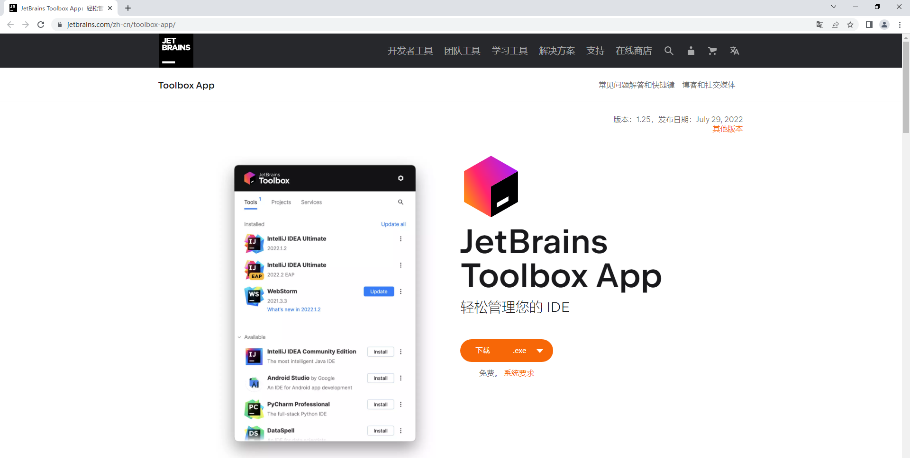
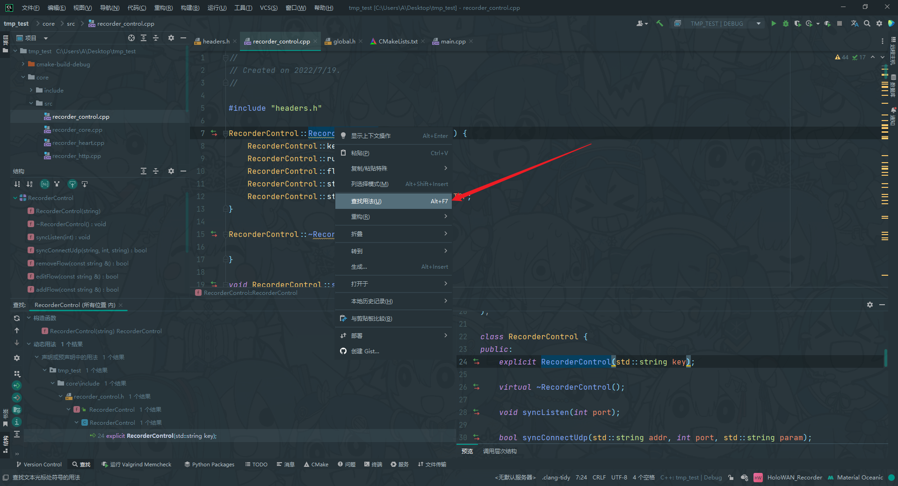

# clion主要用途

> [!NOTE]
> 跨平台开发C/C++程序比较方便而轻量级，当然还是没`Visual studio`直观，中规中矩吧。

> [!Danger]
> clion可能是Java的限制，导致`信号处理调试`比较蛋疼，假如我们需要信号处理，还是老老实实终端执行吧。

## 安装toolbox

[Toolbox官网](https://www.jetbrains.com/zh-cn/toolbox-app)

# 安装Clion

# 让运行进程支持中文

# 选择工具链

# 刷新cmake缓存

# 删除缓存

# 查看内存泄漏

# 查看某个文件的方法

# 查看某个方法调用情况

# 快速生成get、set方法

# 全局替换

# 当前文件内容替换

# 拆分窗口

# 远程部署上传

# 调试模式

