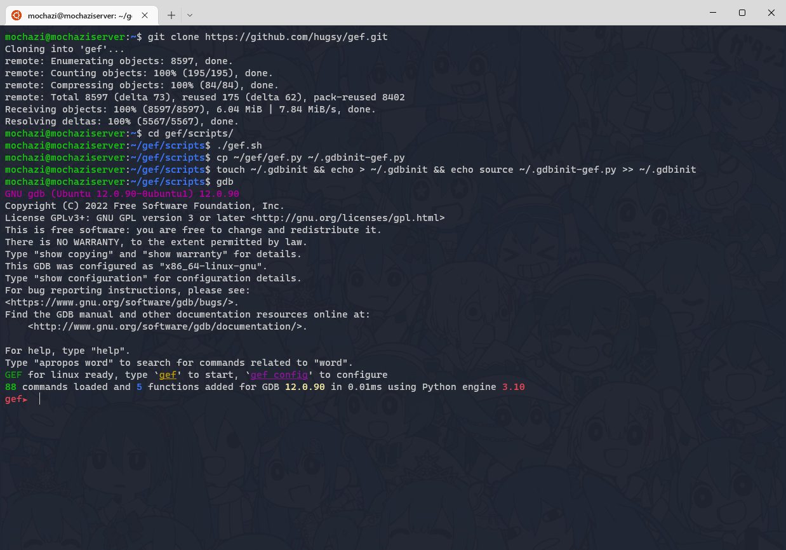
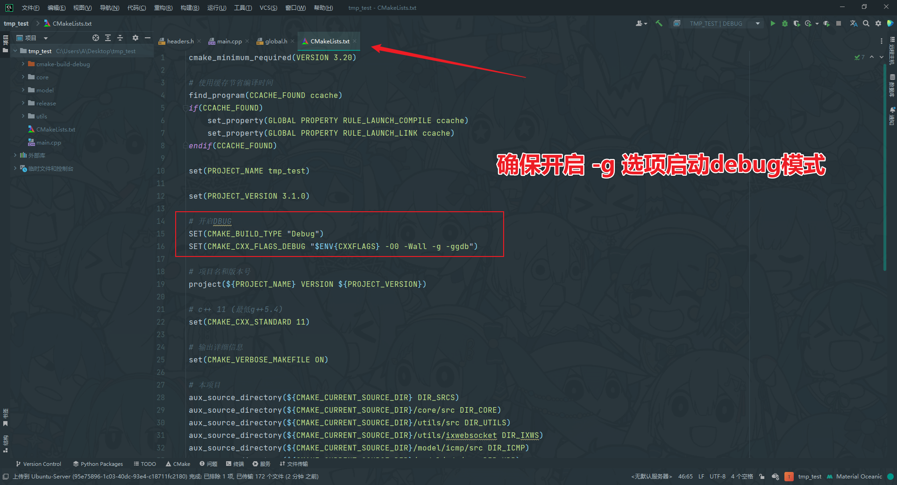
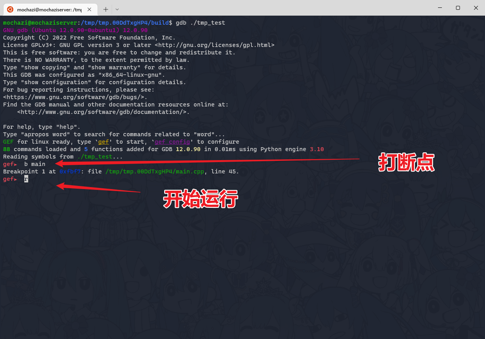
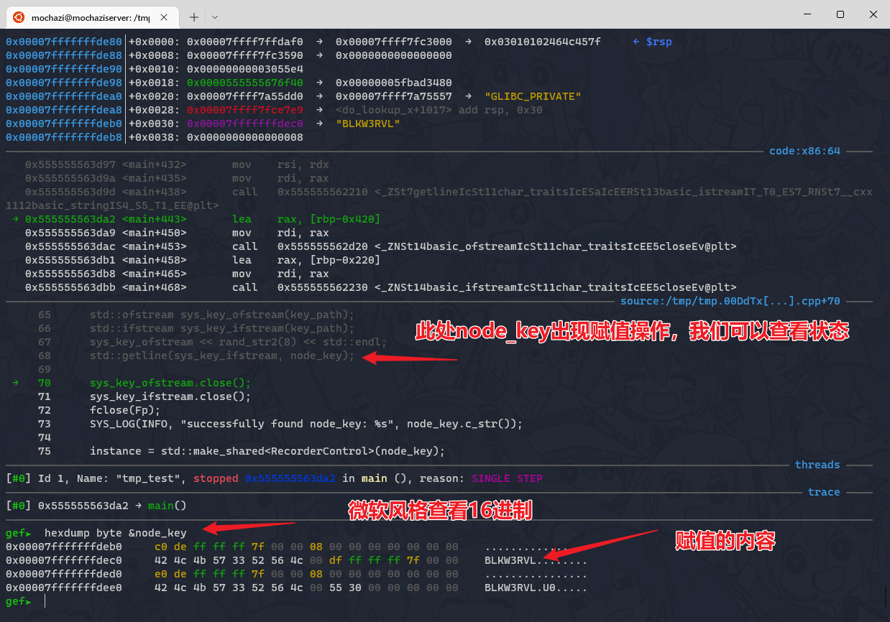

# gef的主要用途

> [!NOTE]
> gef是个GDB的插件，自带很多调试可视化，令GDB显示起来更加优雅、直观。

## 安装指令
```bash
git clone https://github.com/hugsy/gef.git

cd gef/scripts/

./gef.sh

cp ~/gef/gef.py ~/.gdbinit-gef.py

touch ~/.gdbinit && echo > ~/.gdbinit && echo source ~/.gdbinit-gef.py >> ~/.gdbinit

gdb
```



# 基本使用

请确保可执行程序拥有debug信息

```bash
gdb ./可执行程序

b main  # 给main函数打断点

r       # 运行程序

n       # 逐行执行

hexdump byte &a  # 微软风格查看内存( 打断点进入，如：int a = 0;) 
```

## 开启debug模式


## 打断点运行



## 查看变量状态



## 更多指令

> [gef官网文档](https://hugsy.github.io/gef/commands/aliases)

